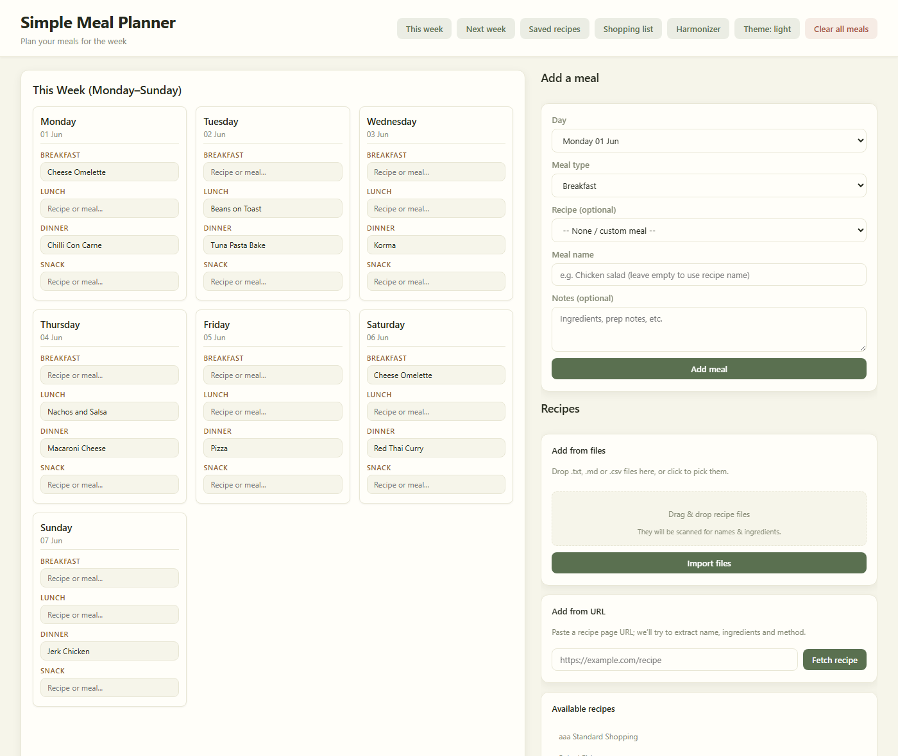
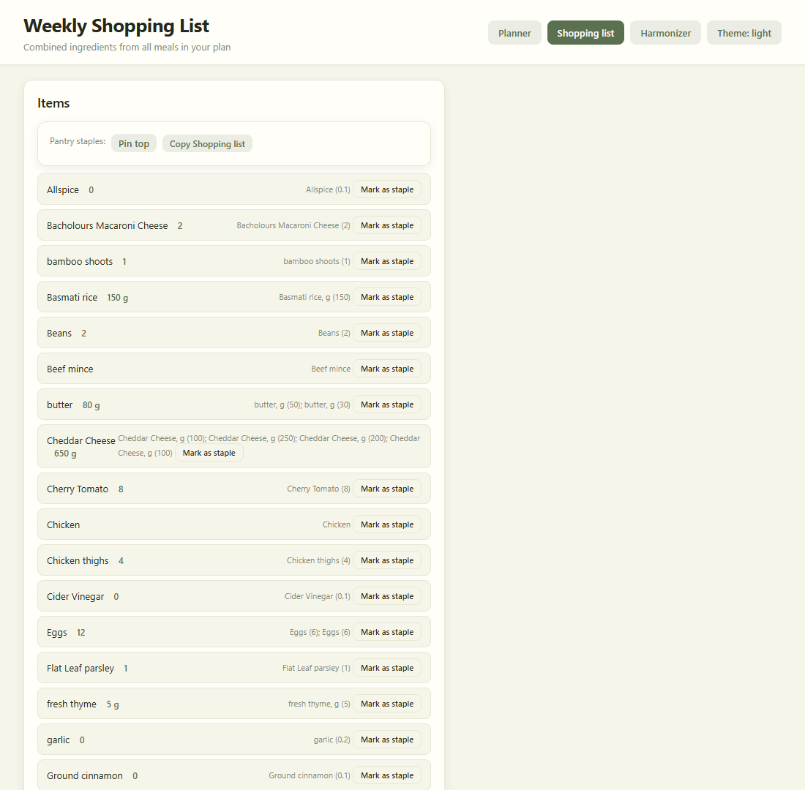
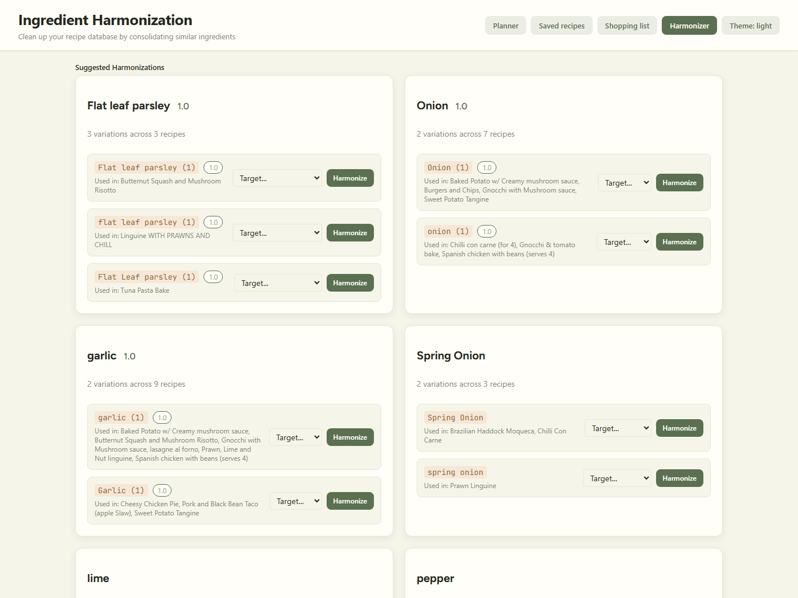
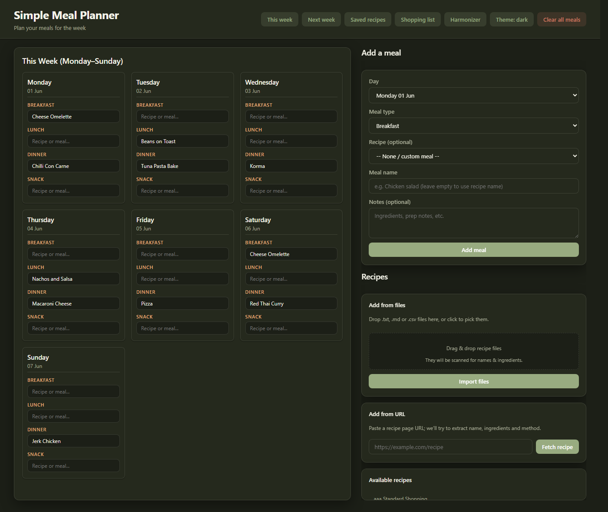

# Meal Planner

A small self-hosted web app for planning a household's weekly meals and turning
the plan into a consolidated, UK-unit shopping list.

Built with Flask + SQLite, it imports a personal recipe library, lets you fill a
weekly grid (drag-and-drop), and aggregates every ingredient across the week into
a single shopping list with sensible unit conversions.

> 📖 New here? See the **[User Guide](UserGuide.md)** for a feature-by-feature
> walkthrough. Developer notes live in [`docs/`](docs/).

## Features

- **Weekly planner** — a Monday–Sunday grid with Breakfast / Lunch / Dinner / Snack
  slots. Drag recipes from the sidebar into slots, or drag one slot onto another to
  swap. Changes auto-save in the background (no page reloads).

  

- **Shopping list** — parses each ingredient line (via
  [`ingredient_parser_nlp`](https://pypi.org/project/ingredient-parser-nlp/)),
  normalizes to UK units (g, kg, ml, l, tsp, tbsp; treats `cup` as US), and sums
  quantities across the week. Items can be pinned as pantry **staples** (sorted to
  the top or bottom), and the whole list can be copied to the clipboard.

  

- **Ingredient harmonizer** — finds ingredients that share a base name but are
  written inconsistently (e.g. `Parmesan` vs `parmesan cheese`) for the *same*
  amount, and bulk-renames them across all recipes.

  

- **Recipe library** — recipes live in SQLite. On first run the app imports every
  file in `meal_planner/recipes/*.{txt,md,csv}`. You can also add, edit, and upload
  recipes from the UI.
- **Import from a URL** — fetches a recipe page and extracts name / ingredients /
  method from JSON-LD or common HTML patterns, with a confirmation step.
- **Light & dark themes** — a warm "paper & sage" palette, with an earthy dark mode
  that's remembered across pages. Light is the default.

  

## Recipe file format

Plain-text recipes (`.txt` / `.md`) follow a simple convention:

```
Chilli Con Carne
URL: https://example.com/chilli        (optional)

- Onion (1)
- Kidney Beans, g (400)
- Beef mince, g (500)
- Sour Cream, pot (1)

METHOD:                                 (optional)
Brown the mince, add everything else, simmer 30 min.
```

- First non-empty line is the **recipe name**.
- Lines starting with `-`, `*`, or `•` are **ingredients**, written as
  `Name, <unit> (<quantity>)` — the unit and comma are optional
  (e.g. `Bananas (5)`, `Cheddar Cheese, g (250)`).
- An optional `METHOD:` line begins the method section.

CSV recipes use a `name,ingredients` header with `;`- or `,`-separated ingredients.

## Running locally

```bash
python -m venv venv
venv\Scripts\activate            # Windows  (use: source venv/bin/activate on macOS/Linux)
pip install -r requirements.txt
python -m meal_planner.app       # or: flask --app meal_planner.app run --port 8717
```

Then open <http://localhost:8717>. The SQLite database is created automatically and
seeded from `meal_planner/recipes/` on first launch.

Set `MEAL_PLANNER_DB` to override the database path (defaults to
`meal_planner/meal_planner.db`).

## Running with Docker

### Pull the published image

Prebuilt images are published to the GitHub Container Registry. For everyday use,
pull `:stable` (the latest tagged release):

```bash
docker pull ghcr.io/pepjr100/meal-planner:stable
docker run -p 8717:8717 -v meal_planner_data:/data ghcr.io/pepjr100/meal-planner:stable
```

#### Image tags

| Tag | Points to | Use it for |
| --- | --- | --- |
| `stable` | the most recent `vX.Y.Z` release | **everyday use** — the recommended tag |
| `latest` | the tip of `main`, rebuilt on every push | trying unreleased changes between versions (may be unstable) |
| `1.0.0`, `1.0` | a specific release | pinning an exact version |
| `sha-<short>` | one immutable build | reproducing or rolling back to an exact commit |

So `stable` only moves when a new version is tagged, while `latest` tracks ongoing
development.

### Build it yourself

```bash
docker build -t meal-planner .
docker run -p 8717:8717 -v meal_planner_data:/data meal-planner
```

Either way the container serves the app with gunicorn on port 8717 and stores its
database at `/data/meal_planner.db`; mount a volume (as above) to persist it across
restarts. Then open <http://localhost:8717>.

## Releasing

Versioning follows [semver](https://semver.org/) via git tags. To cut a release:

```bash
git tag v1.0.0          # vMAJOR.MINOR.PATCH
git push origin v1.0.0
```

Pushing a `vX.Y.Z` tag triggers CI to:

1. build the image and publish it as `:stable`, `:X.Y.Z`, and `:X.Y`, and
2. create a GitHub Release with auto-generated notes.

Ordinary pushes to `main` only update the `:latest` image, so `:stable` stays put
until the next tag. Bump **MAJOR** for breaking changes, **MINOR** for new
features, **PATCH** for fixes.

## Project layout

```
meal_planner/
  app.py             Flask app — routes, recipe parsing, shopping-list aggregation
  recipes/           Seed recipe library (one .txt per recipe)
  templates/         Jinja templates (planner, recipes, shopping list, harmonizer)
  static/style.css   Styles
scripts/
  populate_recipes_from_excel.py   One-off importer from Excel workbooks
docs/
  development-history.md           How the app's features were built (dev notes)
UserGuide.md         End-user guide to every feature
Dockerfile
requirements.txt
```

## Tech stack

Flask · gunicorn · SQLite · `ingredient_parser_nlp` · BeautifulSoup · openpyxl
